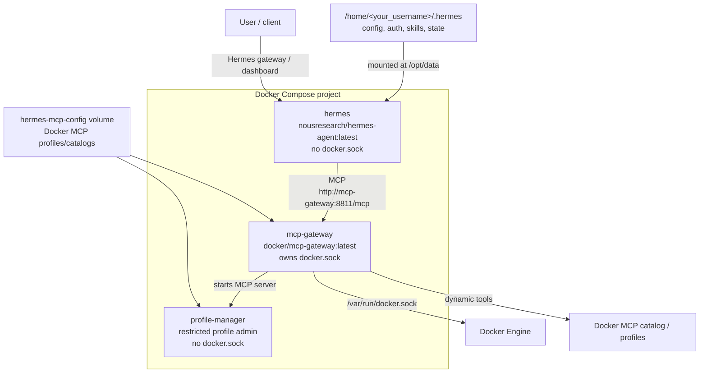

# Hermes Docker Deployment

Docker Compose deployment for the official Hermes agent container with Docker MCP access routed through Docker MCP Gateway.

## Architecture



- Hermes runs from `nousresearch/hermes-agent:latest`.
- Docker MCP Gateway runs from `docker/mcp-gateway:latest`.
- Hermes does not mount `/var/run/docker.sock`.
- Docker MCP Gateway is the only service that holds `/var/run/docker.sock`.
- Hermes connects to Docker MCP Gateway over the compose network at `http://mcp-gateway:8811/mcp`.
- Docker MCP Gateway starts with `--port=8811 --transport=streaming --profile=hermes-default`.
- Docker MCP profiles and catalogs live in the `hermes-mcp-config` Docker volume.
- `profile-manager` is a restricted MCP server for allowlisted profile edits. It does not receive `/var/run/docker.sock`.
- Published ports bind to `127.0.0.1` by default.

## Configure

Create `.env`:

```sh
cp .env.example .env
```

Edit `.env` before starting the stack. At minimum, set the data directory for your host user:

```sh
HERMES_DATA_DIR=/home/<your_username>/.hermes
```

If the default ports are already occupied, change these values:

```sh
HERMES_GATEWAY_PORT=18642
HERMES_DASHBOARD_PORT=19119
MCP_GATEWAY_PORT=18811
```

Optional profile settings:

```sh
MCP_GATEWAY_PROFILE=hermes-default
MCP_GATEWAY_CATALOG_REF=mcp/docker-mcp-catalog:latest
PROFILE_MANAGER_ALLOWED_SERVERS=fetch
```

## Install

```sh
./install.sh
```

Initialize the persistent Docker MCP profile before the first run:

```sh
./scripts/init-profile.sh
```

The initializer builds the restricted `profile-manager` image, generates `catalog/profile-manager.generated.yaml` from `.env`, pulls the official Docker MCP catalog into the `hermes-mcp-config` volume, and creates the managed profile with `profile-manager` enabled.

## First-Time Hermes Setup

Run setup once before starting the compose deployment:

```sh
docker run -it --rm \
  -v /home/<your_username>/.hermes:/opt/data \
  -e HERMES_UID=10000 \
  -e HERMES_GID=10000 \
  nousresearch/hermes-agent:latest setup
```

Use the same `HERMES_UID`, `HERMES_GID`, and `HERMES_DATA_DIR` values that you put in `.env`.

## Run

```sh
./run.sh
```

## Register Docker MCP Gateway

After the containers are running, register Docker MCP Gateway inside Hermes:

```sh
docker exec --user "${HERMES_UID:-10000}:${HERMES_GID:-10000}" -it "${HERMES_CONTAINER_NAME:-hermes}" sh -lc "cd /opt/hermes && /opt/hermes/.venv/bin/hermes mcp add docker-gateway --url 'http://mcp-gateway:8811/mcp'"
```

The Hermes CLI path inside the container is `/opt/hermes/.venv/bin/hermes`.

## Manage Docker MCP Profile

The `profile-manager` MCP server gives Hermes a narrow profile-management surface:

- `profile_list`
- `profile_show`
- `profile_server_add`
- `profile_server_remove`
- `catalog_list`
- `catalog_pull_official`

`profile_server_add` and `profile_server_remove` accept short allowlisted names only, such as `fetch`. They do not accept `docker://`, `file://`, arbitrary images, volumes, environment variables, or shell commands.

To allow more catalog servers, edit `.env`:

```sh
PROFILE_MANAGER_ALLOWED_SERVERS=fetch,github
```

Then rebuild/reinitialize:

```sh
./scripts/init-profile.sh
docker compose up -d --force-recreate mcp-gateway
```

## Logs

```sh
docker compose logs -f
```

## Stop

```sh
docker compose down
```

## Self-Restart Hermes

The official Hermes image starts as root only long enough for its entrypoint to prepare the mounted data directory, then drops privileges to the `hermes` user. Do not add `cap_add: KILL`; the dropped Hermes process has no effective capability set, so `cap_add: KILL` does not make `kill 1` work.

To restart Hermes from inside the running container, terminate the Hermes gateway process owned by the same non-root user:

```sh
docker compose exec --user "${HERMES_UID:-10000}:${HERMES_GID:-10000}" hermes sh -lc 'kill -TERM "$(pgrep -u "$(id -u)" -f "/opt/hermes/.venv/bin/hermes gateway run" | head -n 1)"'
```

Docker Compose starts the Hermes container again because the service uses `restart: always`.

## Verification

```sh
for script in install.sh run.sh; do bash -n "$script"; done
for script in scripts/*.sh; do bash -n "$script"; done
docker compose config >/dev/null
./scripts/init-profile.sh
docker compose up -d
docker compose ps
docker compose exec --user "${HERMES_UID:-10000}:${HERMES_GID:-10000}" hermes sh -lc 'kill -TERM "$(pgrep -u "$(id -u)" -f "/opt/hermes/.venv/bin/hermes gateway run" | head -n 1)"'
sleep 8
docker compose ps
```
