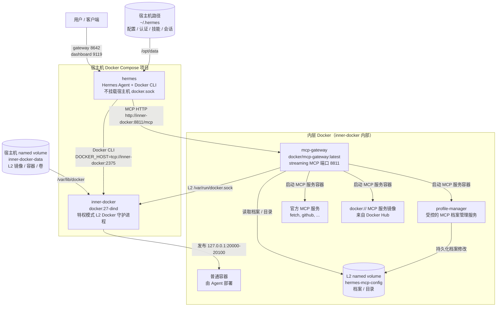

# Hermes Docker 部署项目

基于 Docker Compose 的 [Hermes](https://github.com/nousresearch/hermes-agent) AI Agent 部署方案，使用 Docker-in-Docker 双层架构实现主机 Docker 隔离，并通过 Docker MCP Gateway 管理内部 MCP 服务。

## 目录

- [快速开始](#快速开始)
- [架构设计](#架构设计)
- [两层 Docker 容器挂载表](#两层-docker-容器挂载表)
- [配置说明](#配置说明)
- [部署命令](#部署命令)
- [脚本说明](#脚本说明)
- [注册 Docker MCP Gateway](#注册-docker-mcp-gateway)
- [管理 MCP 配置档案](#管理-mcp-配置档案)
- [在 Hermes 容器中使用 CLI](#在-hermes-容器中使用-cli)
- [查看日志](#查看日志)
- [停止服务](#停止服务)
- [容器内自重启 Hermes](#容器内自重启-hermes)
- [验证部署](#验证部署)

## 快速开始

```sh
cp .env.example .env
```

编辑 `.env`，设置你的数据目录：

```sh
HERMES_DATA_DIR=/home/<你的用户名>/.hermes
```

首次使用时，初始化 Hermes 数据目录：

```sh
docker run -it --rm \
  -v /home/<你的用户名>/.hermes:/opt/data \
  -e HERMES_UID=10000 \
  -e HERMES_GID=10000 \
  nousresearch/hermes-agent:latest setup
```

一键部署并运行冒烟测试：

```sh
./deploy.sh
```

测试通过后会输出：

```text
HERMES_DOCKER_DEPLOYMENT_REAL_TEST_OK
```

## 架构设计

本方案采用 Docker-in-Docker（DinD）双层隔离架构。Hermes Agent 不直接挂载宿主机 `/var/run/docker.sock`，而是通过内部的 L2 Docker Daemon 和 MCP Gateway 进行所有容器操作。



### 架构要点

| 要点 | 说明 |
|------|------|
| Hermes 镜像 | 基于 `nousresearch/hermes-agent:latest`，额外添加 Docker CLI 和 `docker-compose` 插件 |
| GitHub CLI | Hermes 镜像内置 `gh`，可直接进行 GitHub 操作 |
| 主机隔离 | Hermes **不挂载**宿主机 `/var/run/docker.sock` |
| Docker 通信 | Hermes 的 Docker CLI 指向内层 `tcp://inner-docker:2375` |
| DinD 特权 | `inner-docker` 是特权模式容器，在宿主机层面仍然有特权，但隔离了宿主机 Docker socket |
| MCP Gateway | 运行在 L2 Docker 内部，不作为宿主机 Compose 服务 |
| MCP 连接 | Hermes 通过 Compose 网络 `http://inner-docker:8811/mcp` 连接 Gateway |
| 档案存储 | MCP 档案和目录存在 L2 的 `hermes-mcp-config` named volume 中 |
| 服务范围 | `profile-manager`、`fetch`、`docker://` MCP 服务及 Agent 部署的容器全在 L2 内部 |
| 端口绑定 | 默认绑定 `127.0.0.1`：Hermes `8642`、Dashboard `9119`、Gateway `8811`、工作负载 `20000-20100` |

## 两层 Docker 容器挂载表

### 第一层 — 宿主机 Docker Compose（`docker-compose.yml`）

#### `inner-docker`（`docker:27-dind`）

| 类型 | 来源 | 容器内路径 | 模式 | 用途 |
|------|------|-----------|------|------|
| Named Volume | `inner-docker-data` | `/var/lib/docker` | rw | 存储内层 Docker 的镜像、容器、卷等所有数据 |
| Bind Mount | `./catalog/` | `/catalog` | ro | MCP 服务目录配置文件，只读挂入 |
| Bind Mount | `./profile-manager/` | `/profile-manager` | ro | 档案管理器源码，用于在内层构建 `profile-manager` 镜像 |

#### `hermes`（`local/hermes-agent-docker-cli:latest`）

| 类型 | 来源 | 容器内路径 | 模式 | 用途 |
|------|------|-----------|------|------|
| Bind Mount | `/home/<用户名>/.hermes`（由 `HERMES_DATA_DIR` 指定） | `/opt/data` | rw | 持久化 Hermes 配置、认证、技能、会话数据 |

### 第二层 — 内层 Docker（由 `init-profile.sh` 启动）

#### `mcp-gateway`（`docker/mcp-gateway:latest`）

| 类型 | 来源 | 容器内路径 | 模式 | 用途 |
|------|------|-----------|------|------|
| Named Volume（内层） | `hermes-mcp-config` | `/root/.docker/mcp` | rw | MCP 档案和目录数据持久化 |
| Bind Mount（内层） | `/catalog`（来自外层 `./catalog/`） | `/catalog` | ro | MCP 服务目录（透传外层挂载） |
| Bind Mount | `/var/run/docker.sock`（内层 daemon） | `/var/run/docker.sock` | rw | 允许 Gateway 管理内层 Docker 容器 |

#### `profile-manager`（`local/hermes-profile-manager:latest`）

| 类型 | 来源 | 容器内路径 | 模式 | 用途 |
|------|------|-----------|------|------|
| Named Volume（内层） | `hermes-mcp-config` | `/root/.docker/mcp` | rw | 与 Gateway 共享档案配置，实现持久化修改 |

### 挂载路径总览

| 宿主机实际路径 | 流转路径 | 最终使用方 |
|------------|------|-----------|
| `hermes-docker-deployment/catalog/` | → `inner-docker:/catalog` → `mcp-gateway:/catalog` | Gateway 读取 MCP 服务配置 |
| `hermes-docker-deployment/profile-manager/` | → `inner-docker:/profile-manager` | 内层构建 `profile-manager` 镜像用 |
| `/home/<用户名>/.hermes/` | → `hermes:/opt/data` | Hermes Agent 持久化数据 |

> **注意**：`inner-docker-data` 和 `hermes-mcp-config` 均为 Docker Named Volume，不由宿主机文件系统直接访问。重启 Docker 或宿主机均不会丢失数据，除非手动执行 `docker volume rm` 或 `docker compose down -v`。

## 配置说明

从示例文件创建 `.env`：

```sh
cp .env.example .env
```

编辑 `.env`，必填项：

```sh
HERMES_DATA_DIR=/home/<你的用户名>/.hermes
```

端口冲突时修改：

```sh
HERMES_GATEWAY_PORT=18642      # Hermes API 端口，默认 8642
HERMES_DASHBOARD_PORT=19119    # Hermes 面板端口，默认 9119
MCP_GATEWAY_PORT=18811         # MCP Gateway 端口，默认 8811
```

可选档案配置：

```sh
MCP_GATEWAY_PROFILE=hermes-default
MCP_GATEWAY_CATALOG_REF=mcp/docker-mcp-catalog:latest
PROFILE_MANAGER_ALLOWED_SERVERS=*
INNER_WORKLOAD_PORT_START=20000
INNER_WORKLOAD_PORT_END=20100
```

`PROFILE_MANAGER_ALLOWED_SERVERS=*` 允许目录中所有合法服务名。如需限制，改为逗号分隔的白名单，例如 `fetch,github`。

## Hermes WebUI 维护

当前部署把 Hermes WebUI 作为 `hermes` 容器内的伴随进程运行：Compose 先执行 `start-hermes-with-webui.sh`，该脚本在 `/opt/data/hermes-webui/server.py` 存在时后台启动 WebUI，然后再启动 `hermes gateway run`。WebUI 源码和状态不打进镜像，仍保存在 `${HERMES_DATA_DIR}/hermes-webui` 和 `${HERMES_DATA_DIR}/webui`，因此重建 Hermes 镜像不会覆盖 WebUI checkout 或用户状态。

维护流程：

1. 在 `.env` 中设置 `HERMES_WEBUI_PASSWORD` 和 `HERMES_API_KEY`，不要把实际密钥提交到 Git。
2. WebUI 代码更新时，在宿主机 `${HERMES_DATA_DIR}/hermes-webui` 中执行 `git pull`，必要时按该项目 README 更新依赖。
3. Hermes 镜像更新时先 `docker compose build hermes`，再在维护窗口执行 `docker compose up -d --force-recreate hermes`。
4. 重建后确认端口映射仍包含 `${HERMES_WEBUI_PORT:-20200}:8787`，并检查 `docker logs hermes --tail 80` 中的 `[webui]` 启动日志。
5. 如果需要临时关闭 WebUI，在 `.env` 设置 `HERMES_WEBUI_ENABLED=0` 后 recreate `hermes`。

WebUI 对外端口由 `HERMES_WEBUI_PORT` 控制，默认 `20200`；容器内端口固定为 `8787`。

## 部署命令

| 命令 | 作用 |
|------|------|
| `./install.sh` | 准备 `.env`、校验脚本、启动 `inner-docker`、构建内层 `profile-manager` 镜像、初始化 MCP 档案、启动内层 Gateway、安装 Hermes 技能 |
| `./run.sh` | 刷新部署状态、启动 `hermes` 容器、在 Hermes 中注册 `docker-gateway` |
| `./deploy.sh` | 依次执行 `run.sh` + `scripts/real-smoke-test.sh`（推荐日常使用） |

## 脚本说明

`scripts/` 下的脚本均为部署流程的一部分：

| 脚本 | 功能 |
|------|------|
| `scripts/init-profile.sh` | 启动 `inner-docker`、在内层构建 `profile-manager` 镜像、生成目录条目、拉取 MCP 目录、写入档案、启动内层 `mcp-gateway` |
| `scripts/install-hermes-skill.sh` | 将 Docker MCP Gateway 操作技能安装到 `${HERMES_DATA_DIR}` |
| `scripts/ask-yui.sh` | 向运行中的 Hermes 容器发送一条提示词 |
| `scripts/real-smoke-test.sh` | 验证宿主机容器、L2 Docker、Gateway、Hermes MCP 注册，以及真实 Agent 提示词是否返回 `HERMES_DOCKER_DEPLOYMENT_REAL_TEST_OK` |

## 注册 Docker MCP Gateway

`run.sh` 会自动在 Hermes 中注册 `docker-gateway`。需要手动修复注册时：

```sh
docker exec --user "${HERMES_UID:-10000}:${HERMES_GID:-10000}" -it "${HERMES_CONTAINER_NAME:-hermes}" \
  sh -lc "cd /opt/hermes && /opt/hermes/.venv/bin/hermes mcp add docker-gateway --url 'http://inner-docker:8811/mcp'"
```

Hermes 容器内二进制路径为 `/opt/hermes/.venv/bin/hermes`。

## 管理 MCP 配置档案

`profile-manager` MCP 服务为 Hermes 提供受控的档案管理能力，支持的工具有：

- `profile_list` — 列出所有 MCP 档案
- `profile_show` — 查看受管档案详情
- `profile_server_add` — 添加目录中的 MCP 服务到档案（仅限短名称，如 `fetch`、`github`）
- `profile_server_add_image` — 添加 Docker 镜像形式的 MCP 服务
- `profile_server_remove` — 从档案中移除服务
- `profile_server_remove_image` — 移除 Docker 镜像形式的 MCP 服务
- `catalog_list` — 列出可用目录
- `catalog_pull_official` — 拉取官方 Docker MCP 目录

修改档案配置后重新执行：

```sh
./run.sh
```

Gateway 使用 `--watch` 运行，但 Hermes Agent 工具 schema 在新建任务时才会重新加载。如新工具不可见，请重启内层 `mcp-gateway`、重启 Hermes 并开始新任务。

## 在 Hermes 容器中使用 CLI

进入容器时，必须以 Hermes 用户身份并使用虚拟环境中的二进制：

```sh
# 交互式
docker exec -it --user 10000:10000 hermes sh -lc 'cd /opt/hermes && exec bash'

# 进去后
.venv/bin/hermes --help
.venv/bin/hermes sessions list
```

或者直接执行单条命令：

```sh
docker exec -it --user 10000:10000 hermes \
  sh -lc 'cd /opt/hermes && .venv/bin/hermes sessions list'
```

> **注意**：`--user` 必须放在容器名 `hermes` 之前。必须用 `hermes` 用户（UID 10000），不能用 root。二进制路径是 `/opt/hermes/.venv/bin/hermes`，不在默认 `$PATH` 中。

## 查看日志

```sh
# 宿主机 Compose 服务日志
docker compose logs -f

# 内层 mcp-gateway 日志
docker compose exec inner-docker docker -H tcp://127.0.0.1:2375 logs -f mcp-gateway
```

## 停止服务

```sh
docker compose down
```

如需要彻底清理（包括 named volume 数据）：

```sh
docker compose down -v
```

## 容器内自重启 Hermes

Hermes 镜像以 root 启动后立即切换到 `hermes` 用户。容器内直接 `kill 1` 不生效。

如需从容器内重启，结束 Hermes 网关进程（`restart: always` 会让 Docker 自动拉起）：

```sh
docker compose exec --user "${HERMES_UID:-10000}:${HERMES_GID:-10000}" hermes \
  sh -lc 'kill -TERM "$(pgrep -u "$(id -u)" -f "/opt/hermes/.venv/bin/hermes gateway run" | head -n 1)"'
```

## 验证部署

```sh
# 语法检查
for script in deploy.sh install.sh run.sh; do bash -n "$script"; done
for script in scripts/*.sh; do bash -n "$script"; done
docker compose config >/dev/null

# 部署并验证
./deploy.sh
docker compose ps
docker compose exec inner-docker docker -H tcp://127.0.0.1:2375 ps
docker compose exec inner-docker docker -H tcp://127.0.0.1:2375 logs --tail 80 mcp-gateway
grep -q HERMES_DOCKER_DEPLOYMENT_REAL_TEST_OK logs/ask-yui-real-smoke.log
```
