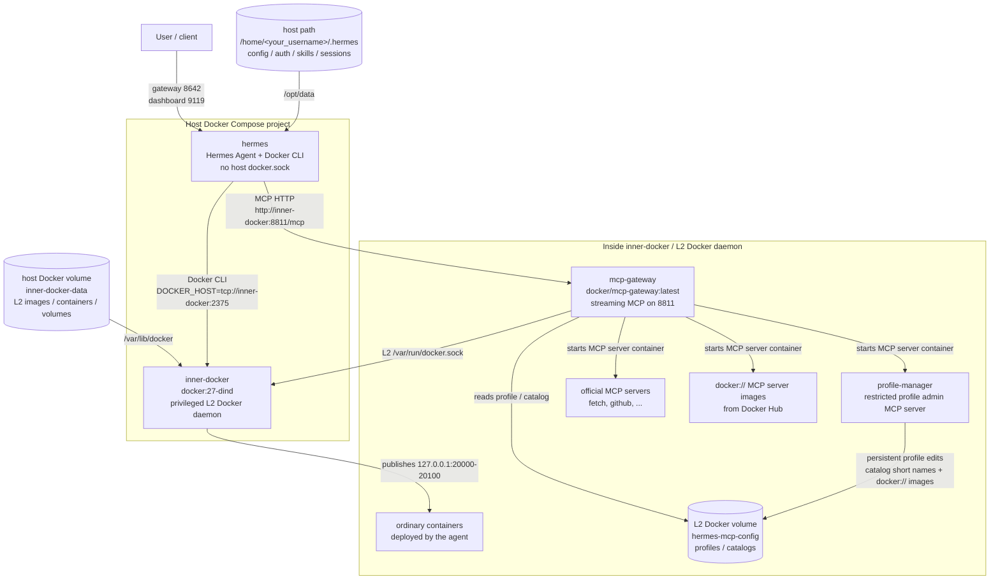

# Hermes Docker Deployment

Docker Compose deployment for the official Hermes agent container with Docker MCP access routed through Docker MCP Gateway and an inner Docker daemon.

## Quick Start

```sh
cp .env.example .env
```

Edit `.env` and set:

```sh
HERMES_DATA_DIR=/home/<your_username>/.hermes
```

Run Hermes setup once if this data directory has not been initialized:

```sh
docker run -it --rm \
  -v /home/<your_username>/.hermes:/opt/data \
  -e HERMES_UID=10000 \
  -e HERMES_GID=10000 \
  nousresearch/hermes-agent:latest setup
```

Deploy the full stack and run the real smoke test:

```sh
./deploy.sh
```

`deploy.sh` starts the stack, registers Docker MCP Gateway in Hermes, then runs `scripts/real-smoke-test.sh`. The smoke test includes a real Hermes agent prompt through `scripts/ask-yui.sh`; success prints:

```text
HERMES_DOCKER_DEPLOYMENT_REAL_TEST_OK
```

## Architecture



- Hermes runs from a thin local image based on `nousresearch/hermes-agent:latest` with Docker CLI added.
- Hermes does not mount the host `/var/run/docker.sock`.
- Hermes Docker CLI points to the inner L2 Docker daemon at `tcp://inner-docker:2375`.
- `inner-docker` is a privileged DinD container. It isolates Hermes from the host Docker socket, but it is still privileged at the host container boundary.
- Docker MCP Gateway runs inside the L2 Docker daemon, not as a host Docker Compose service.
- Hermes connects to Docker MCP Gateway over the compose network at `http://inner-docker:8811/mcp`.
- Docker MCP Gateway starts with `--port=8811 --transport=streaming --profile=hermes-default`.
- Docker MCP profiles and catalogs live in the L2 `hermes-mcp-config` Docker volume.
- `profile-manager`, `fetch`, `docker://` MCP servers, and agent-deployed ordinary containers all run inside L2 Docker.
- The bundled Hermes skill teaches the agent how to use Gateway, catalogs, profiles, Docker image MCP servers, and L2 Docker safely.
- Published ports bind to `127.0.0.1` by default: Hermes `8642`, dashboard `9119`, Gateway `8811`, workload range `20000-20100`.

## Features

- Everything-in-Docker deployment: Hermes runs in host Docker; Docker MCP Gateway, profile-manager, official MCP servers, `docker://` MCP servers, and agent workloads run in an inner L2 Docker daemon.
- Minimal host requirements: Docker Engine with Compose support and a persistent Hermes data directory.
- Host Docker isolation: Hermes never receives the host Docker socket. Its Docker CLI talks only to the inner L2 Docker daemon.
- Persistent L2 Docker state: inner Docker images, containers, volumes, and MCP profiles live in the `inner-docker-data` Docker volume.
- Native tool schema path: Gateway loads profile servers inside L2 and exposes their MCP tools to Hermes through one `docker-gateway` MCP endpoint.
- Agent-manageable profiles: the bundled `profile-manager` lets Hermes agent add/remove catalog servers and add Docker image MCP servers through MCP tools.
- L2 Docker CLI: The agent can deploy and manage ordinary containers in the inner Docker daemon without touching host Docker.
- One-command deployment: `deploy.sh` covers inner Docker startup, profile-manager image build, profile initialization, skill installation, Gateway startup, Hermes MCP registration, and a real agent smoke test.

## Configure

Create `.env`:

```sh
cp .env.example .env
```

Edit `.env` before starting the stack. At minimum, set the data directory for your host user:

```sh
HERMES_DATA_DIR=/home/<your_username>/.hermes
```

If the default ports are already occupied, change these values:

```sh
HERMES_GATEWAY_PORT=18642
HERMES_DASHBOARD_PORT=19119
MCP_GATEWAY_PORT=18811
```

Optional profile settings:

```sh
MCP_GATEWAY_PROFILE=hermes-default
MCP_GATEWAY_CATALOG_REF=mcp/docker-mcp-catalog:latest
PROFILE_MANAGER_ALLOWED_SERVERS=*
INNER_WORKLOAD_PORT_START=20000
INNER_WORKLOAD_PORT_END=20100
```

Use `PROFILE_MANAGER_ALLOWED_SERVERS=*` to allow any valid short server name from the configured catalog. Docker image MCP servers are installed with `profile_server_add_image`. `file://`, path-like inputs, arbitrary volumes, and shell commands remain rejected.

## Deployment Commands

```sh
./install.sh
./run.sh
./deploy.sh
```

- `install.sh` prepares `.env`, validates shell/Compose files, starts `inner-docker`, builds `profile-manager` inside L2, initializes the persistent Docker MCP profile, starts the inner Gateway, and installs the Hermes skill.
- `run.sh` refreshes the same deployment state, starts `hermes`, and non-interactively registers `docker-gateway` in Hermes with all Gateway tools enabled.
- `deploy.sh` runs `run.sh` and then `scripts/real-smoke-test.sh`. This is the recommended command after first-time Hermes setup.

## Scripts

The scripts in `scripts/` are part of the deployment flow and are intentionally tracked:

- `scripts/init-profile.sh` starts `inner-docker`, builds `profile-manager` inside L2 Docker, generates the local catalog entry, pulls the Docker MCP catalog, writes `profile-manager` into the persistent profile, and starts the inner `mcp-gateway`.
- `scripts/install-hermes-skill.sh` installs the Docker MCP Gateway operation skill into `${HERMES_DATA_DIR}`.
- `scripts/ask-yui.sh` sends one prompt into the running Hermes container.
- `scripts/real-smoke-test.sh` verifies host containers, L2 Docker, Gateway, Hermes MCP registration, and a real agent prompt that must return `HERMES_DOCKER_DEPLOYMENT_REAL_TEST_OK`.

Generated local files are ignored instead:

- `.env`
- `catalog/profile-manager.generated.yaml`
- `docs/`
- Python cache files

## Register Docker MCP Gateway

`./run.sh` registers Docker MCP Gateway inside Hermes if `docker-gateway` is missing. To repair the registration manually, run:

```sh
docker exec --user "${HERMES_UID:-10000}:${HERMES_GID:-10000}" -it "${HERMES_CONTAINER_NAME:-hermes}" sh -lc "cd /opt/hermes && /opt/hermes/.venv/bin/hermes mcp add docker-gateway --url 'http://inner-docker:8811/mcp'"
```

The Hermes CLI path inside the container is `/opt/hermes/.venv/bin/hermes`.

`run.sh` performs this registration non-interactively by answering Hermes CLI prompts. It enables all tools exposed by Gateway.

## Manage Docker MCP Profile

The `profile-manager` MCP server gives Hermes a narrow profile-management surface:

- `profile_list`
- `profile_show`
- `profile_server_add`
- `profile_server_add_image`
- `profile_server_remove`
- `profile_server_remove_image`
- `catalog_list`
- `catalog_pull_official`

`profile_server_add` and `profile_server_remove` accept short catalog server names only, such as `fetch` or `aks`. `profile_server_add_image` and `profile_server_remove_image` accept Docker image references for MCP server images and manage them as `docker://...` entries inside L2 Docker. `file://`, arbitrary paths, volumes, environment variables, and shell commands are still rejected.

By default, `.env.example` uses:

```sh
PROFILE_MANAGER_ALLOWED_SERVERS=*
```

This allows any valid short server name from `MCP_GATEWAY_CATALOG_REF`. To restrict it, replace `*` with a comma-separated allowlist:

```sh
PROFILE_MANAGER_ALLOWED_SERVERS=fetch,github
```

After changing profile settings, rerun:

```sh
./run.sh
```

Gateway runs with `--watch`, but Hermes agent tool schemas are injected when a new run prompt is built. If newly installed tools are not visible, restart the inner `mcp-gateway`, restart Hermes, and start a new Hermes task.

Hermes also has Docker CLI access to the inner L2 daemon:

```sh
docker ps
docker logs mcp-gateway
docker restart mcp-gateway
docker run -d --name agent-app-demo -p 20080:8080 nginx:alpine
```

Those commands target `DOCKER_HOST=tcp://inner-docker:2375`, not the host Docker daemon.

## Logs

```sh
docker compose logs -f
docker compose exec inner-docker docker -H tcp://127.0.0.1:2375 logs -f mcp-gateway
```

## Stop

```sh
docker compose down
```

## Self-Restart Hermes

The official Hermes image starts as root only long enough for its entrypoint to prepare the mounted data directory, then drops privileges to the `hermes` user. Do not add `cap_add: KILL`; the dropped Hermes process has no effective capability set, so `cap_add: KILL` does not make `kill 1` work.

To restart Hermes from inside the running container, terminate the Hermes gateway process owned by the same non-root user:

```sh
docker compose exec --user "${HERMES_UID:-10000}:${HERMES_GID:-10000}" hermes sh -lc 'kill -TERM "$(pgrep -u "$(id -u)" -f "/opt/hermes/.venv/bin/hermes gateway run" | head -n 1)"'
```

Docker Compose starts the Hermes container again because the service uses `restart: always`.

## Verification

```sh
for script in deploy.sh install.sh run.sh; do bash -n "$script"; done
for script in scripts/*.sh; do bash -n "$script"; done
docker compose config >/dev/null
python3 -m unittest discover -s tests -v
./deploy.sh
docker compose ps
docker compose exec inner-docker docker -H tcp://127.0.0.1:2375 ps
docker compose exec inner-docker docker -H tcp://127.0.0.1:2375 logs --tail 80 mcp-gateway
grep -q HERMES_DOCKER_DEPLOYMENT_REAL_TEST_OK logs/ask-yui-real-smoke.log
```
