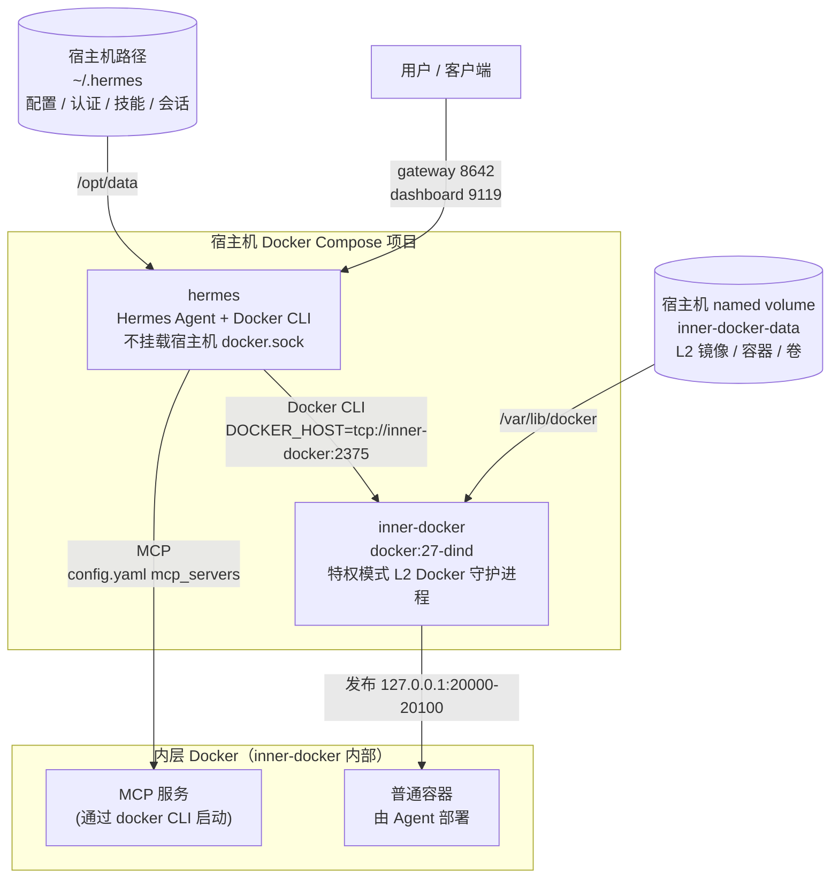

# Hermes Docker 部署项目

基于 Docker Compose 的 [Hermes](https://github.com/nousresearch/hermes-agent) AI Agent 部署方案，使用 Docker-in-Docker 双层架构实现主机 Docker 隔离。Hermes 通过 Docker CLI 直接管理内层 Docker 容器，并直接在 `config.yaml` 中注册 MCP 服务器。

## 目录

- [快速开始](#快速开始)
- [架构设计](#架构设计)
- [两层 Docker 容器挂载表](#两层-docker-容器挂载表)
- [配置说明](#配置说明)
- [部署命令](#部署命令)
- [脚本说明](#脚本说明)
- [MCP 服务器注册](#mcp-服务器注册)
- [在 Hermes 容器中使用 CLI](#在-hermes-容器中使用-cli)
- [查看日志](#查看日志)
- [停止服务](#停止服务)
- [容器内自重启 Hermes](#容器内自重启-hermes)
- [验证部署](#验证部署)

## 快速开始

```sh
cp .env.example .env
```

编辑 `.env`，设置你的数据目录：

```sh
HERMES_DATA_DIR=/home/<你的用户名>/.hermes
```

首次使用时，初始化 Hermes 数据目录：

```sh
docker run -it --rm \
  -v /home/<你的用户名>/.hermes:/opt/data \
  -e HERMES_UID=10000 \
  -e HERMES_GID=10000 \
  nousresearch/hermes-agent:latest setup
```

一键部署并运行冒烟测试：

```sh
./deploy.sh
```

测试通过后会输出：

```text
HERMES_DOCKER_DEPLOYMENT_REAL_TEST_OK
```

## 架构设计

本方案采用 Docker-in-Docker（DinD）双层隔离架构。Hermes Agent 不直接挂载宿主机 `/var/run/docker.sock`，而是通过内部的 L2 Docker Daemon 进行所有容器操作。



### 架构要点

| 要点 | 说明 |
|------|------|
| Hermes 镜像 | 基于 `nousresearch/hermes-agent:latest`，额外添加 Docker CLI 和 `docker-compose` 插件 |
| GitHub CLI | Hermes 镜像内置 `gh`，可直接进行 GitHub 操作 |
| 主机隔离 | Hermes **不挂载**宿主机 `/var/run/docker.sock` |
| Docker 通信 | Hermes 的 Docker CLI 指向内层 `tcp://inner-docker:2375` |
| DinD 特权 | `inner-docker` 是特权模式容器，在宿主机层面仍然有特权，但隔离了宿主机 Docker socket |
| MCP 注册 | 直接在 `config.yaml` 的 `mcp_servers` 下注册，URL 用 `http://inner-docker:<port>/mcp` |
| 端口绑定 | 默认绑定 `127.0.0.1`：Hermes `8642`、Dashboard `9119`、工作负载 `20000-20100` |

## 两层 Docker 容器挂载表

### 第一层 — 宿主机 Docker Compose（`docker-compose.yml`）

#### `inner-docker`（`docker:27-dind`）

| 类型 | 来源 | 容器内路径 | 模式 | 用途 |
|------|------|-----------|------|------|
| Named Volume | `inner-docker-data` | `/var/lib/docker` | rw | 存储内层 Docker 的镜像、容器、卷等所有数据 |

#### `hermes`（`local/hermes-agent-docker-cli:latest`）

| 类型 | 来源 | 容器内路径 | 模式 | 用途 |
|------|------|-----------|------|------|
| Bind Mount | `/home/<用户名>/.hermes`（由 `HERMES_DATA_DIR` 指定） | `/opt/data` | rw | 持久化 Hermes 配置、认证、技能、会话数据 |

### 挂载路径总览

| 宿主机实际路径 | 流转路径 | 最终使用方 |
|------------|------|-----------|
| `/home/<用户名>/.hermes/` | → `hermes:/opt/data` | Hermes Agent 持久化数据 |

> **注意**：`inner-docker-data` 为 Docker Named Volume，不由宿主机文件系统直接访问。重启 Docker 或宿主机均不会丢失数据，除非手动执行 `docker volume rm` 或 `docker compose down -v`。

## 配置说明

从示例文件创建 `.env`：

```sh
cp .env.example .env
```

编辑 `.env`，必填项：

```sh
HERMES_DATA_DIR=/home/<你的用户名>/.hermes
```

端口冲突时修改：

```sh
HERMES_GATEWAY_PORT=18642      # Hermes API 端口，默认 8642
HERMES_DASHBOARD_PORT=19119    # Hermes 面板端口，默认 9119
```

内层 Docker 工作负载端口范围：

```sh
INNER_WORKLOAD_PORT_START=20000
INNER_WORKLOAD_PORT_END=20100
```

## 部署命令

| 命令 | 作用 |
|------|------|
| `./install.sh` | 准备 `.env`、校验脚本、启动 Compose 服务 |
| `./run.sh` | 启动 Compose 服务并验证容器运行状态 |
| `./deploy.sh` | 依次执行 `run.sh` + `scripts/real-smoke-test.sh`（推荐日常使用） |

## 脚本说明

`scripts/` 下的脚本均为部署流程的一部分：

| 脚本 | 功能 |
|------|------|
| `scripts/ask-yui.sh` | 向运行中的 Hermes 容器发送一条提示词 |
| `scripts/real-smoke-test.sh` | 验证宿主机容器、L2 Docker、Hermes MCP 注册，以及真实 Agent 提示词是否返回 `HERMES_DOCKER_DEPLOYMENT_REAL_TEST_OK` |

## MCP 服务器注册

Hermes 直接通过 `config.yaml` 注册 MCP 服务器，无需中间网关：

```yaml
mcp_servers:
  <name>:
    url: http://inner-docker:<port>/mcp
    enabled: true
```

部署 MCP 服务时：

1. 用 Docker CLI 在 inner-docker 上启动容器（`DOCKER_HOST=tcp://inner-docker:2375`）
2. 在 `config.yaml` 注册 URL 指向 `http://inner-docker:<port>/mcp`
3. `/reload-mcp` 即可加载新工具

非 MCP 的服务（如 Web 应用）使用 Watchtower label 模式自动 CD。

## 在 Hermes 容器中使用 CLI

进入容器时，必须以 Hermes 用户身份并使用虚拟环境中的二进制：

```sh
# 交互式
docker exec -it --user 10000:10000 hermes sh -lc 'cd /opt/hermes && exec bash'

# 进去后
.venv/bin/hermes --help
.venv/bin/hermes sessions list
```

或者直接执行单条命令：

```sh
docker exec -it --user 10000:10000 hermes \
  sh -lc 'cd /opt/hermes && .venv/bin/hermes sessions list'
```

> **注意**：`--user` 必须放在容器名 `hermes` 之前。必须用 `hermes` 用户（UID 10000），不能用 root。二进制路径是 `/opt/hermes/.venv/bin/hermes`，不在默认 `$PATH` 中。

## 查看日志

```sh
# 宿主机 Compose 服务日志
docker compose logs -f
```

## 停止服务

```sh
docker compose down
```

如需要彻底清理（包括 named volume 数据）：

```sh
docker compose down -v
```

## 容器内自重启 Hermes

Hermes 镜像以 root 启动后立即切换到 `hermes` 用户。容器内直接 `kill 1` 不生效。

如需从容器内重启，结束 Hermes 网关进程（`restart: always` 会让 Docker 自动拉起）：

```sh
docker compose exec --user "${HERMES_UID:-10000}:${HERMES_GID:-10000}" hermes \
  sh -lc 'kill -TERM "$(pgrep -u "$(id -u)" -f "/opt/hermes/.venv/bin/hermes gateway run" | head -n 1)"'
```

## 验证部署

```sh
# 语法检查
for script in deploy.sh install.sh run.sh; do bash -n "$script"; done
for script in scripts/*.sh; do bash -n "$script"; done
docker compose config >/dev/null

# 部署并验证
./deploy.sh
docker compose ps
docker compose exec inner-docker docker -H tcp://127.0.0.1:2375 ps
grep -q HERMES_DOCKER_DEPLOYMENT_REAL_TEST_OK logs/ask-yui-real-smoke.log
```
